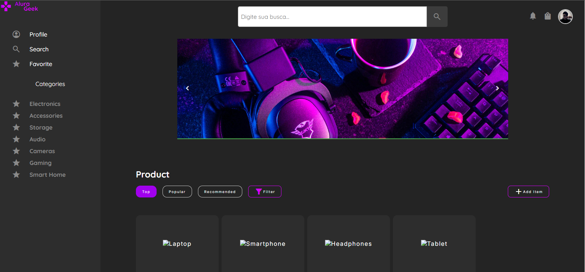
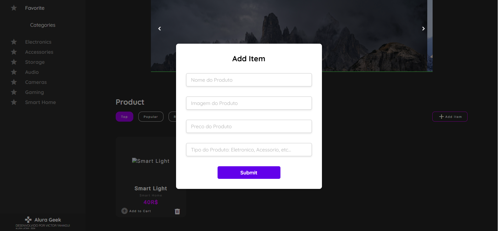

# Challenge Alura Geek

## Descrição
Este projeto faz parte do desafio proposto pelo Oracle One Next em colaboração com a Alura, que tem como objetivo avaliar os conhecimentos adquiridos ao longo do curso. O desafio envolve a criação de um site funcional e bem estruturado, seguindo as melhores práticas de desenvolvimento front-end.

## Demonstração
<p align="center">
  
</p>
<p align="center">
  
</p>


## Funcionalidades
- **Pesquisa (Search)**: O site possui uma barra de busca no topo que permite procurar por produtos em todo o catálogo. Além disso, há um campo de pesquisa no `aside` que filtra produtos pertencentes à mesma categoria, facilitando a navegação.
- **Criação de Produtos (Create)**: Um botão "Add Item" abre um modal onde é possível preencher as informações de um novo produto. Ao clicar em "Submit", o produto é criado e adicionado à lista.
- **Exclusão de Produtos (Delete)**: Cada card de produto possui um botão de lixeira que permite a exclusão do item. A função verifica o elemento clicado e o `id` do produto para garantir que o item correto seja removido.
- **Carrossel de Promoções (Carousel)**: O carrossel de promoções avança automaticamente a cada 5 segundos, mas também pode ser controlado manualmente ao clicar nas setas laterais. Para adicionar novas promoções, basta inserir as imagens no arquivo `promoCarousel.js`, e elas aparecerão automaticamente.

## Tecnologias Utilizadas
- **HTML**: Estrutura do site
- **CSS**: Estilização e design responsivo
- **JavaScript**: Funcionalidades dinâmicas, como busca, modal, e carrossel
- **JSON-Server**: Utilizado para mockar dados de produtos e simular uma API

## Como Executar o Projeto
1. **Clone o repositório**:
   ```bash
   git clone https://github.com/VictorYahagui/Challenge-Oracle-AluraGeek.git
   ```
2. Navegue até o diretório do projeto
   ```bash
   cd Challenge-Oracle-AluraGeek
   ```
3. Instale as dependências
   ```bash
   npm install
   ```
4. Abra o `index.html` no seu navegador para visualizar o site.
